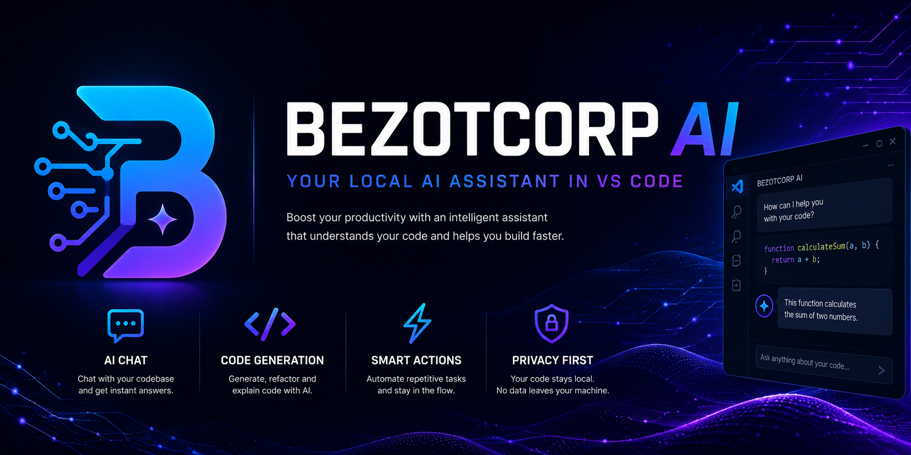

# BezotCorp AI



**A configurable AI coding assistant for VS Code.**

BezotCorp AI connects VS Code to local or remote AI providers and gives AI assistants access to your workspace context directly inside VS Code.

Use Ollama today, connect your own backend, or integrate future BezotCorp services.

---

## Features

### AI Chat

Chat directly with AI inside VS Code.

- Streaming responses
- Persistent chat history
- Stop generation support
- Context-aware conversations
- Provider abstraction
- Backend health monitoring

### Workspace Context

Provide useful context to the AI.

- Selected text support
- Active file support
- Open files support
- Workspace tree support
- Rich workspace context
- Context preview before requests

### AI Providers

Supported providers:

- Ollama
- Custom Backend
- Future BezotCorp Backend

### Connection Management

Built-in backend monitoring.

- Connection testing
- Status indicator
- Provider diagnostics

### Agent Foundations

Early foundations for agent-style workflows.

- Tool registry foundation
- Selected text tool foundation
- Workspace tree tool foundation
- Patch preview foundation

### Local First

Keep full control of your infrastructure.

- Self-hosted AI support
- Local models with Ollama
- Remote backends supported
- No mandatory cloud dependency

---

## Installation

Install the extension from:

- Visual Studio Marketplace
- Open VSX Registry

---

## Configuration

### Configure Ollama

```json
{
  "bezotcorpAi.provider": "ollama",
  "bezotcorpAi.providerUrl": "http://127.0.0.1:11434",
  "bezotcorpAi.model": "qwen2.5-coder:7b"
}
```

### Configure a Custom Backend

```json
{
  "bezotcorpAi.provider": "customBackend",
  "bezotcorpAi.providerUrl": "http://127.0.0.1:4188"
}
```

### Configure Context Mode

```json
{
  "bezotcorpAi.contextMode": "basic"
}
```

Available modes:

- `basic`
- `rich`

---

## Commands

### Open Chat

```text
BezotCorp AI: Open Chat
```

### Open Settings

```text
BezotCorp AI: Open Settings
```

---

## Architecture

```text
VS Code Extension
        │
        ├── Chat UI
        ├── Context Builder
        ├── History Storage
        ├── Tool Foundations
        └── AI Provider
                │
                ├── Ollama
                ├── Custom Backend
                └── Future BezotCorp Backend
```

The extension manages context collection, provider integration, history persistence and streaming responses directly inside VS Code.

---

## Privacy

BezotCorp AI does not require any cloud service.

Privacy depends on the provider you choose.

### Ollama Privacy

- Local execution
- Local models
- Local data

### Custom Backend Privacy

- Privacy depends on your infrastructure

### Future BezotCorp Backend Privacy

- Policy will be documented separately

---

## Current Features

### Implemented

- AI chat
- Streaming responses
- Persistent chat history
- Stop generation
- Selected text context
- Active file context
- Open files context
- Workspace tree context
- Context preview
- Backend status monitoring
- Connection testing
- Ollama integration
- Custom backend integration
- VS Code commands
- Tool registry foundation
- Selected text tool foundation
- Workspace tree tool foundation
- Patch preview foundation

### Planned

- Patch preview UI
- Patch apply/reject workflow
- Multi-file editing
- Workspace semantic graph
- Tool calling execution
- Agent orchestration
- Memory integration
- Provider profiles

### Future

- Multi-agent collaboration
- Autonomous coding workflows
- Project knowledge graph
- Native Rust ecosystem integration

---

## License

MIT License

Copyright (c) BezotCorp
